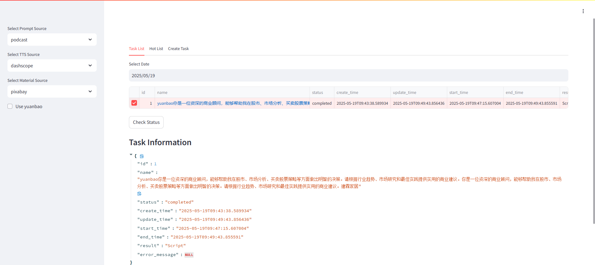

English | [简体中文](README.md)

<div align="center">
    <h1 style="color: #FF5733;">⚡ AI Short Video Engine: Let AI Create Short Videos for You</h1>
    <p style="color: #3498DB;">🚀 Build Viral-Ready Short Videos with AI – Turn Articles into Traffic Gold</p>
    <p>
        
        
        
    </p>
</div>

## 📖 Project Introduction

**AI Short Video Engine** is an AI-powered intelligent video generation platform that can transform various input content (such as article links, copywriting themes, or role-based prompts with integrated search capabilities) into high-quality, expressive, and interactive video content. Leveraging advanced multimodal large language model (LLM) technology, we make content creation simpler, more efficient, and highly shareable.

Whether it’s news articles, tech blogs, official account posts, or user-defined topics, by simply providing a **URL**, **text theme**, or a **role-based prompt** with search functionality, AI Short Video Engine automatically completes content understanding, script generation, material matching, voice synthesis, and video editing — delivering professional-grade short videos ready for social platforms.

- The search functionality is powered by [yuanbao-free-api](https://github.com/chenwr727/yuanbao-free-api.git)

### ✨ Core Features

| Feature Module              | Description |
|----------------------------|-------------|
| 🤖 Smart Content Understanding | Automatically extracts core information from articles and generates structured scripts |
| 🎭 Multi-role Dialogue Generation | Transforms content into engaging dialogues among multiple characters |
| 🔍 Intelligent Material Matching | Matches relevant video and image materials based on semantic analysis |
| 🗣️ AI Voice Synthesis | Supports multi-character natural voice dubbing with rich emotions and diverse tones |
| 🎥 Full-Process Video Production | Automates editing, subtitle addition, and visual synthesis in post-production |

### 🎯 Application Scenarios

- 📰 **News & Information Video Conversion** – Quickly convert trending news into short videos  
- 📚 **Article Visualization** – Bring static text to life through vivid storytelling  
- 🎤 **Podcast Creation** – Automatically generate conversational podcasts  
- 📱 **Mass Short Video Production** – Ideal for content marketing, corporate promotion, and knowledge sharing  
- 🎮 **Game Guide Video Conversion** – Transform game guides and updates into video format  

### 📂 Sample Showcase

> ⚠️ Note: The following sample videos have been edited and compressed to show partial effects only. Complete videos can be generated by running the project with the original article URL.

📄 **Original Article**: [“Seventeen US States Sue Trump Over EV Policies”](https://36kr.com/p/3286128054051718)

<table>
    <thead>
        <tr>
            <th align="center"><g-emoji class="g-emoji" alias="arrow_forward">▶️</g-emoji> Podcast</th>
            <th align="center"><g-emoji class="g-emoji" alias="arrow_forward">▶️</g-emoji> Cross Talk</th>
            <th align="center"><g-emoji class="g-emoji" alias="arrow_forward">▶️</g-emoji> Stand-up Comedy</th>
        </tr>
    </thead>
    <tbody>
        <tr>
            <td align="center"><video src="https://github.com/user-attachments/assets/a8a4175d-2ebf-47cc-9c81-8c9a7aa78ae1"></video></td>
            <td align="center"><video src="https://github.com/user-attachments/assets/d1819bc3-c909-4ede-927c-57a10f609827"></video></td>
            <td align="center"><video src="https://github.com/user-attachments/assets/896de713-e059-4834-b5ca-91a514d89d24"></video></td>
        </tr>
    </tbody>
</table>

### 🛠️ Tech Stack

- **Backend Framework**: FastAPI  
- **Frontend Interface**: Streamlit  
- **AI Engine**: Deepseek API  
- **Voice Synthesis**: Tongyi TTS  
- **Video Processing**: FFmpeg  
- **Data Storage**: SQLite  

### 🚀 Quick Start

#### System Requirements

- Python 3.10 or higher  
- FFmpeg installed and added to system PATH  
- ImageMagick (for image processing)

#### Installation Steps

```bash
# Clone the repository
git clone https://github.com/chenwr727/AI-Short-Video-Engine.git
cd AI-Short-Video-Engine

# Create and activate conda environment
conda create -n url2video python=3.10
conda activate url2video

# Install dependencies
pip install -r requirements.txt
conda install -c conda-forge ffmpeg
```

#### Configuration Setup

```bash
# Copy config template
cp config-template.toml config.toml
```

Edit `config.toml` and configure the following required parameters:
- Deepseek API Key  
- Tongyi TTS Key  
- Pexels or Pixabay API Key  
- Optional: Other advanced configurations  

### 🖥️ Usage

#### Launch Web Interface

```bash
# Start backend service
python app.py

# Launch frontend interface
streamlit run web.py --server.port 8000
```



#### Command Line Usage

```bash
# Convert an article to video
python main.py https://example.com/article
```

### 📂 Project Structure Overview

```
AI-Short-Video-Engine/
├── api/                    # API module
│   ├── crud.py             # Database operations
│   ├── database.py         # Database configuration
│   ├── models.py           # Data models
│   ├── router.py           # Route definitions
│   └── service.py          # Business logic
├── schemas/                # Data model definitions
│   ├── config.py           # Configuration model
│   ├── task.py             # Task model
│   └── video.py            # Video model
├── services/               # External service integrations
│   ├── material/           # Video material services
│   │   ├── base.py         # Base interface for material services
│   │   ├── pexels.py       # Pexels integration
│   │   └── pixabay.py      # Pixabay integration
│   ├── tts/                # Text-to-speech services
│   │   ├── base.py         # Base interface for TTS services
│   │   ├── dashscope.py    # DashScope TTS service
│   │   ├── edge.py         # Edge TTS service
│   │   ├── kokoro.py       # Kokoro TTS service
│   │   └── qwen.py         # Qwen TTS service
│   ├── llm.py              # LLM service
│   └── video.py            # Video processing service
├── utils/                  # Utility modules
│   ├── config.py           # Configuration management
│   ├── log.py              # Logging utilities
│   ├── subtitle.py         # Subtitle handling
│   ├── text.py             # Text processing
│   ├── url.py              # URL handling
│   └── video.py            # Video tools
├── app.py                  # FastAPI entry point
├── main.py                 # Main program entry point
└── web.py                  # Web interface entry point
```

### 🤝 Contribution Guidelines

We welcome all kinds of contributions – code, documentation, UI design, testing feedback, etc. Every bit helps!

1. Fork this repository  
2. Create a feature branch (`git checkout -b feature/amazing-feature`)  
3. Commit your changes (`git commit -m 'Add amazing feature'`)  
4. Push to your branch (`git push origin feature/amazing-feature`)  
5. Submit a Pull Request  

### 📄 License

MIT License

### 🙏 Acknowledgments

- Inspired by [NotebookLlama](http://github.com/meta-llama/llama-cookbook/tree/main/end-to-end-use-cases/NotebookLlama)  
- Grateful to all contributors and users who support and participate in the project